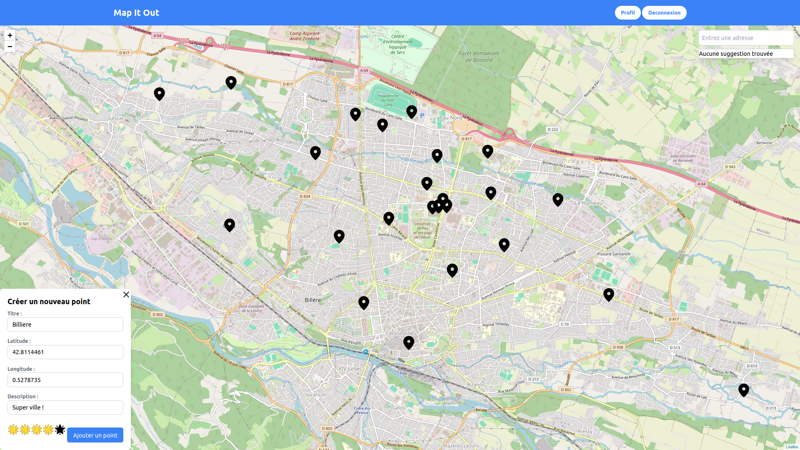
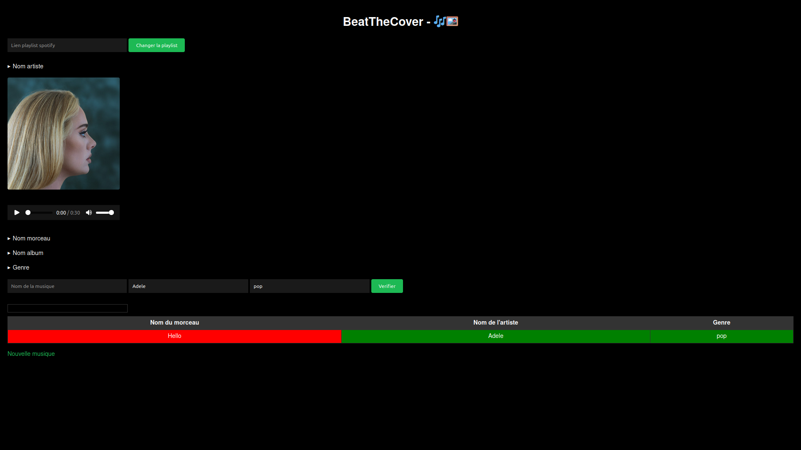

# 👋 About me

- 👨‍🎓: Hey! I'm a 22-year-old computer engineering student at [CY Tech](https://cytech.cyu.fr) in Pau, France, with a interest in computer science and its applications.
- 🌏: Currently, I'm broadening my academic horizons through a semester-long exchange program at [NYCU](https://www.nycu.edu.tw/nycu/en/index) in Taiwan, focusing on advanced studies in computer science and artificial intelligence.
- 🧠: My dedication to the field drives me to explore the latest advancements in AI and machine learning, seeking opportunities to apply innovative solutions to real-world challenges.
- 💼: Actively pursuing apprenticeship opportunities in AI for the upcoming academic year 2024/2025, I aim to contribute my skills and knowledge to impactful projects in the field.

# 📭 Contact

	
	&nbsp;
	
	&nbsp;
	

<!---->

# 📚 Computer language skills

<table align="center">
	<thead>
		<tr>
			<th colspan="1"><b>General-purpose</b></th>
			<th colspan="2"><b>Web development</b></th>
			<th colspan="1"><b>Environment</b></th>
			<th colspan="1"><b>DevOps Tools</b></th>
			<th colspan="1"><b>Databases</b></th>
			<th colspan="1"><b>Other</b></th>
		</tr>
	</thead>
	<tbody>
		<tr>
			<td align="center"><a href="https://en.wikipedia.org/wiki/C_(programming_language)">C</a></td>
			<td align="center"><a href="https://en.wikipedia.org/wiki/HTML">HTML</a></td>
			<td align="center"><a href="https://en.wikipedia.org/wiki/JavaScript">JavaScript</a></td>
			<td align="center"><a href="https://en.wikipedia.org/wiki/Unix_shell">Shell Script</a></td>
			<td align="center"><a href="https://www.jenkins.io/">Jenkins</a></td>
			<td align="center"><a href="https://sql.sh">SQL</a></td>
			<td align="center"><a href="https://en.wikipedia.org/wiki/Unix_shell">14 Design Patterns</a></td>
		</tr>
		<tr>
			<td align="center"><a href="https://www.python.org/">Python</a></td>
			<td align="center"><a href="https://en.wikipedia.org/wiki/CSS">CSS</a></td>
			<td align="center"><a href="https://www.php.net/manual/en/intro-whatis.php">PHP</a></td>
			<td align="center"><a href="https://en.wikipedia.org/wiki/Linux">Unix / Linux</a></td>
			<td align="center"><a href="https://www.ansible.com/">Ansible</a></td>
			<td></td>
			<td align="center"><a href="https://junit.org/">JUnit</a></td>
		</tr>
		<tr>
			<td align="center"><a href="https://en.wikipedia.org/wiki/Java_(programming_language)">Java</a></td>
			<td align="center"><a href="https://jquery.com/">jQuery</a></td>
			<td align="center"><a href="https://nodejs.org/en/">Node.js</a></td>
			<td align="center"><a href="https://git-scm.com">GIT</a></td>
			<td></td>
			<td></td>
			<td></td>
		</tr>
		<tr>
			<td align="center"><a href="https://en.wikipedia.org/wiki/Prolog">Prolog</a></td>
			<td align="center"><a href="https://en.wikipedia.org/wiki/Jakarta_EE">Jakarta EE</a></td>
			<td></td>
			<td align="center"><a href="https://www.docker.com/">Docker</a></td>
			<td></td>
			<td></td>
			<td></td>
		</tr>
	</tbody>
</table>

# 📂 Projects

## 👨‍💻 AI Projects

### 🎲 [15 Puzzle Solver](https://github.com/QuentinDucoulombier/15-Puzzle-Solver) (A* algorithm, November 2023)

A Python program implementing the A* algorithm to solve the 15 puzzle game, also known as the "Taquin" puzzle. The program offers both manual and automatic solving options, allowing users to choose between Manhattan distance and Hamming distance heuristics.

### ⭕ [Tic-tac-toe Solver](https://github.com/QuentinDucoulombier/Tic-tac-toe-Solver) (MiniMax algorithm, December 2023)

This repository contains two Python programs, `morpionMiniMax.py` and `morpionAlphaBeta.py`, designed to solve the Tic-tac-toe game using different algorithms - Minimax and Alpha-Beta Pruning. The Minimax algorithm explores all possible game states to find the optimal move, while Alpha-Beta Pruning enhances this process by eliminating branches that cannot affect the final decision.

<!--Add NYCU projects-->

## 🌐 Projects in Web Development

### 🌟 [Map It Out](https://github.com/QuentinDucoulombier/MapItOut) (Web Development, November 2023)

Map It Out is a Jakarta EE project following the MVC architecture and CRUD API principles. It's a mapping application where users can mark and share their favorite locations, powered by Leaflet.js for map management. Perfect for keeping track of your go-to spots and sharing them with others!

	

### 🧠 [IA Pau website](https://github.com/QuentinDucoulombier/ing1-gi-groupe-1) (Web Development, June 2023)

A showcase website project for the [IA PAU](https://iapau.org/) association, designed to efficiently handle registrations, provide presentations, and oversee a variety of challenges. Additionally, the website conducts an in-depth analysis of code quality and presents detailed statistics.

This website utilizes various technologies including Html/css, js, php, MySQL, and Java (for the API component).

Example of the home page (public access):

	

For more information, check [here](https://docs.google.com/presentation/d/1qzV_f_YjHGfAb2iBl9mgQmtHlzuQVG42ra4eSolH0pw/edit?usp=sharing)

### 🎵 [Beat the cover](https://github.com/QuentinDucoulombier/BeatTheCover/tree/dev) (Web development, In progress)

Personal project under development of "blind test" developed in Nodejs and ejs thanks to the spotify api.
  
BeatTheCover is a fun and interactive web-based game that challenges players to guess the title, artist, and genre of a song based on progressively revealed audio clips and album cover art.

Current interface:  

	</a>

### 📖 [CY-Parcours](https://github.com/QuentinDucoulombier/CY-parcours) (Web Development, June 2022)

Website that assigns CY Tech options based on students' rankings and choices using the [stable marriage](https://en.wikipedia.org/wiki/Gale–Shapley_algorithm) algorithm (using js, php, html, css, ajax and jQuery).

Example of home page:

	

### ✈️ [TASSTAITIDN](https://github.com/QuentinDucoulombier/CYTECH-dev-web/tree/main/INGdevWeb/ING1GI3-DUCOULOMBIER-QUENTIN) (Web Development, May 2023)

Website of mystery destination sale (use of js, php, html, css, ajax and database (MySQL)).  
  
Example of home page:

	

## 💻 Projects in C

### [Huffman Project](https://github.com/QuentinDucoulombier/Projet-huffman) (December 2021)

Huffman coding is a lossless data compression algorithm. Huffman coding uses a variable-length code to represent a source symbol (for example, a character in a file). The code is determined from an estimate of the probabilities of occurrence of source symbols, with a short code associated with the most frequent source symbols.

A Huffman code is optimal in the sense of the shortest length for a per-symbol coding, and a known probability distribution. More complex methods that perform probabilistic modeling of the source provide better compression ratios.

This algorithm allows to compress in binary then to decompress text files thanks to the Huffman coding, so it uses binary trees, fast sorting and chained lists.

### [Game of Life](https://github.com/QuentinDucoulombier/Jeu-De-La-Vie) (May 2021)

The [Game of Life](https://en.wikipedia.org/wiki/Conway%27s_Game_of_Life) is a cellular automaton. It is a zeo-player game, which means that its evolution is determined by its initial state and requires no further input. One interacts with the game of life by creating an initial configuration and observing how it evolves. It is turing complete.  
Example of a graph:

	

### [SE-Prio](https://github.com/QuentinDucoulombier/SE-Prio) (October 2022)
Small project to order processes based on priority (both preemptive and non-preemptive).  
Example :

	

## 🌍 [Script Shell](https://github.com/QuentinDucoulombier/Projet-Script-Shell-Pays) (in bash, January 2022)

This project allows the exploitation of .csv files containing energy information according to countries/continents and/or time.
Our project allows to represent these data with graphs to illustrate and compare them. Moreover, with the help of some commands, we have easier access to the data (e.g. the total consumption of a certain renewable energy).
All this is possible thanks to a clear script and a menu.

Example of a graph: 

	

<!--
## 🔬 [Solving Schrödinger's equation](https://github.com/QuentinDucoulombier/Bureau-DEtude) (in C, May 2022)

The objective of this project is to solve Schrödinger's equation with a program in C for configurations where this equation is not solvable by hand.  

Schrödinger equation:

	 
	

For this we use two methods:

- The rkf45 method
- Powell's method
-->
